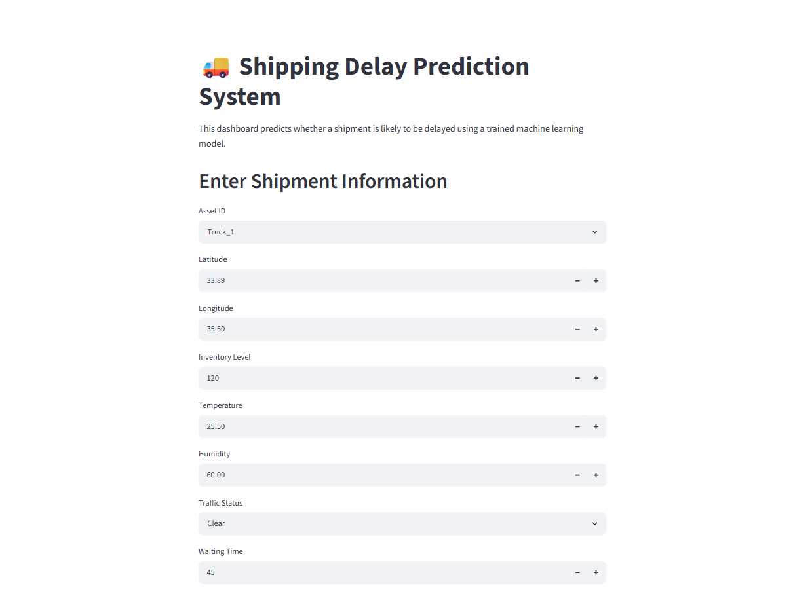
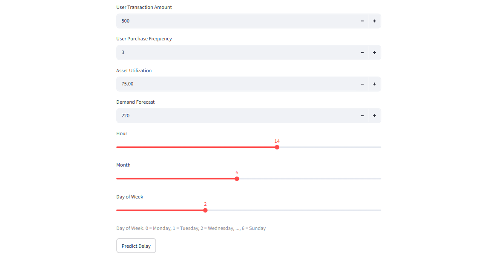
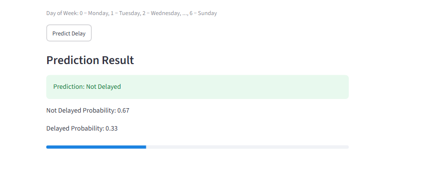
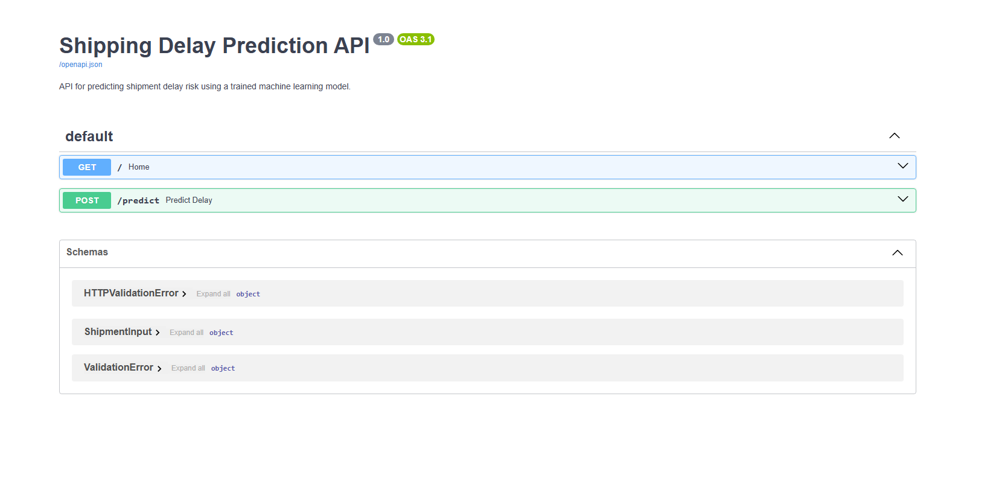
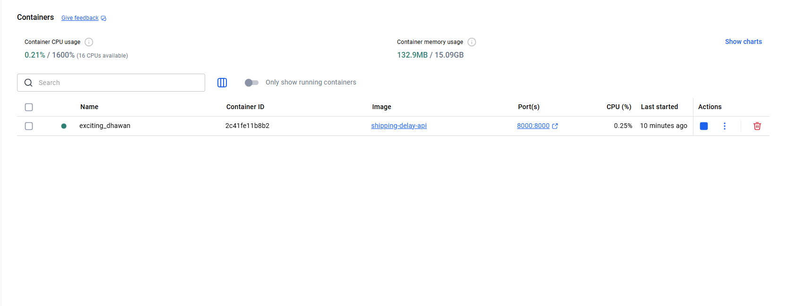

# Shipping Delay Prediction System

This project is an end-to-end machine learning system that predicts whether a shipment is likely to be delayed using logistics-related data.

The goal of this project is to demonstrate how artificial intelligence can support logistics decision-making by predicting delay risk from shipment, traffic, demand, asset, and time-related features.

---

## Project Objective

The objective is to build an end-to-end AI project for shipment delay prediction.

The system takes shipment information as input and predicts:

* Delayed
* Not Delayed

It also returns the delay probability.

---

## Problem Type

This is a binary classification problem.

* `0` = Not Delayed
* `1` = Delayed

The target column is:

```text
Logistics_Delay
```

---

## Dataset

The dataset contains 1000 logistics records and 16 original columns.

Main features include:

* Asset ID
* Latitude
* Longitude
* Inventory Level
* Shipment Status
* Temperature
* Humidity
* Traffic Status
* Waiting Time
* User Transaction Amount
* User Purchase Frequency
* Logistics Delay Reason
* Asset Utilization
* Demand Forecast
* Timestamp
* Logistics Delay

The target column is:

```text
Logistics_Delay
```

---

## Data Preprocessing

The original dataset was cleaned and prepared before model training.

### Timestamp Feature Engineering

The original `Timestamp` column was converted into useful time-based features:

* `Hour`
* `Month`
* `DayOfWeek`

These features help the model learn time-related delay patterns, such as daily, weekly, and seasonal effects.

### Removed Columns

The following columns were removed:

* `Timestamp`
* `Logistics_Delay_Reason`
* `Shipment_Status`

`Timestamp` was removed after extracting useful time features.

`Logistics_Delay_Reason` was removed because the reason for delay may not be known before prediction.

`Shipment_Status` was removed because it caused data leakage. For example, if `Shipment_Status` is already "Delayed", the model can easily know the answer without truly learning useful patterns.

---

## Data Leakage Detection

During the first training attempt, the model achieved 100% accuracy, precision, recall, and F1-score.

This result was suspicious, so data leakage was investigated.

The column `Shipment_Status` was found to strongly reveal the target value. For example:

```text
Shipment_Status = Delayed  →  Logistics_Delay = 1
```

Because of this, `Shipment_Status` was removed from the training data.

After removing this leakage column, the model performance became more realistic.

---

## Features Used for Training

After preprocessing, the final features used for training were:

* Asset_ID
* Latitude
* Longitude
* Inventory_Level
* Temperature
* Humidity
* Traffic_Status
* Waiting_Time
* User_Transaction_Amount
* User_Purchase_Frequency
* Asset_Utilization
* Demand_Forecast
* Hour
* Month
* DayOfWeek

The target column was:

* Logistics_Delay

---

## Models Compared

Three machine learning models were trained and compared:

1. Logistic Regression
2. Random Forest
3. XGBoost

The models were evaluated using:

* Accuracy
* Precision
* Recall
* F1-score
* Confusion Matrix

---

## Model Comparison Results

| Model               | Accuracy | Precision | Recall | F1-score |
| ------------------- | -------: | --------: | -----: | -------: |
| Logistic Regression |    0.765 |     0.912 |  0.646 |    0.756 |
| Random Forest       |    0.730 |     0.864 |  0.619 |    0.722 |
| XGBoost             |    0.740 |     0.843 |  0.664 |    0.743 |

The best model was:

```text
Logistic Regression
```

Logistic Regression was selected because it achieved the highest F1-score.

---

## Final Model Performance

The selected model achieved the following performance:

| Metric    | Score |
| --------- | ----: |
| Accuracy  | 76.5% |
| Precision | 91.2% |
| Recall    | 64.6% |
| F1-score  | 75.6% |

Confusion Matrix:

```text
[[80  7]
 [40 73]]
```

This means:

* 80 shipments were correctly predicted as Not Delayed
* 7 shipments were predicted as Delayed but were actually Not Delayed
* 40 shipments were predicted as Not Delayed but were actually Delayed
* 73 shipments were correctly predicted as Delayed

---

## Why F1-score Was Used

Accuracy alone is not enough for this project.

In shipment delay prediction, it is important to balance:

* Precision: When the model predicts a delay, how often it is correct
* Recall: How many real delayed shipments the model catches

F1-score combines precision and recall into one balanced metric.

Therefore, the final model was selected based on the highest F1-score.

---

## Technologies Used

* Python
* pandas
* NumPy
* scikit-learn
* XGBoost
* Streamlit
* FastAPI
* Uvicorn
* Docker
* joblib
* Git
* GitHub

---

## Project Structure

```text
shipping-delay-prediction/
│
├── api/
│   └── main.py
│
├── dashboard/
│   └── app.py
│
├── data/
│   ├── smart_logistics.csv
│   └── cleaned_logistics.csv
│
├── models/
│   ├── delay_model.pkl
│   └── best_delay_model.pkl
│
├── screenshots/
│   ├── streamlit_dashboard_top.png
│   ├── streamlit_dashboard_middle.png
│   ├── streamlit_dashboard_result.png
│   ├── fastapi_docs.png
│   └── docker_running.png
│
├── check_dataset.py
├── check_leakage.py
├── compare_models.py
├── eda.py
├── prepare_data.py
├── predict_delay.py
├── train_model.py
│
├── Dockerfile
├── .dockerignore
├── .gitignore
├── requirements.txt
└── README.md
```

---

## Streamlit Dashboard

The Streamlit dashboard allows users to enter shipment-related information through an interactive interface.

The dashboard takes inputs such as:

* Asset ID
* Location
* Inventory level
* Temperature
* Humidity
* Traffic status
* Waiting time
* User transaction amount
* User purchase frequency
* Asset utilization
* Demand forecast
* Hour
* Month
* Day of week

After clicking the prediction button, the dashboard displays:

* Prediction result
* Not delayed probability
* Delayed probability

---

## FastAPI Backend

FastAPI was used to expose the trained machine learning model as a backend API.

The API receives shipment information in JSON format, sends it to the trained model, and returns the prediction result.

The main endpoint is:

```text
POST /predict
```

This makes the model usable by other applications, company systems, dashboards, or services.

---

## Docker Deployment

Docker was added to make the FastAPI backend easier to run on another machine or server.

Docker packages the project code, trained model, libraries, and runtime environment into one container.

This means another user does not need to manually install all Python libraries. They only need Docker installed.

---

## How to Run the Project Locally

### 1. Clone the Repository

```bash
git clone https://github.com/YOUR_USERNAME/shipping-delay-prediction.git
cd shipping-delay-prediction
```

Replace `YOUR_USERNAME` with your GitHub username.

---

### 2. Create a Virtual Environment

```bash
python -m venv .venv
```

Activate it on Windows:

```bash
.venv\Scripts\activate
```

---

### 3. Install Requirements

```bash
pip install -r requirements.txt
```

---

## How to Run the Streamlit Dashboard

Run:

```bash
streamlit run dashboard/app.py
```

Then open:

```text
http://localhost:8501
```

---

## How to Run the FastAPI API

Run:

```bash
uvicorn api.main:app --reload
```

Then open:

```text
http://127.0.0.1:8000
```

API documentation is available at:

```text
http://127.0.0.1:8000/docs
```

---

## Example API Request

Endpoint:

```text
POST /predict
```

Example input:

```json
{
  "Asset_ID": "Truck_7",
  "Latitude": 33.8938,
  "Longitude": 35.5018,
  "Inventory_Level": 120,
  "Temperature": 25.5,
  "Humidity": 60.0,
  "Traffic_Status": "Heavy",
  "Waiting_Time": 45,
  "User_Transaction_Amount": 500,
  "User_Purchase_Frequency": 3,
  "Asset_Utilization": 75.0,
  "Demand_Forecast": 220,
  "Hour": 14,
  "Month": 6,
  "DayOfWeek": 2
}
```

Example output:

```json
{
  "prediction": "Delayed",
  "not_delayed_probability": 0.01,
  "delayed_probability": 0.99
}
```

---

## How to Run with Docker

Build the Docker image:

```bash
docker build -t shipping-delay-api .
```

Run the Docker container:

```bash
docker run -p 8000:8000 shipping-delay-api
```

Then open:

```text
http://127.0.0.1:8000
```

API documentation:

```text
http://127.0.0.1:8000/docs
```

---

## Screenshots

### Streamlit Dashboard

#### Dashboard - Input Fields Part 1



#### Dashboard - Input Fields Part 2



#### Dashboard - Prediction Result



### FastAPI Documentation



### Docker Running



---

## Business Value

This project shows how machine learning can help logistics companies predict shipment delay risk before it happens.

Such a system can support:

* Better delivery planning
* Early delay detection
* Improved customer communication
* More efficient logistics operations
* Data-driven decision-making

---

## What I Learned

Through this project, I practiced:

* Building an end-to-end machine learning project
* Cleaning and preprocessing logistics data
* Detecting and removing data leakage
* Creating time-based features
* Comparing multiple machine learning models
* Evaluating models using accuracy, precision, recall, and F1-score
* Saving and loading trained models
* Building an interactive Streamlit dashboard
* Creating a FastAPI prediction endpoint
* Running the backend with Docker
* Preparing a professional GitHub project

---

## Future Improvements

Future improvements may include:

* Adding real port and vessel data
* Adding origin and destination ports
* Adding route distance
* Adding weather API data
* Improving recall to catch more delayed shipments
* Adding model monitoring
* Deploying the API to the cloud
* Connecting the Streamlit dashboard directly to the FastAPI backend
* Using a larger real-world logistics dataset

---

## Project Relevance

This project is relevant to logistics and shipping companies because it demonstrates how AI can be used to predict shipment delay risk and support operational decision-making.

It shows a complete machine learning workflow from data preprocessing to model training, evaluation, dashboard development, API creation, and Docker-based deployment.
